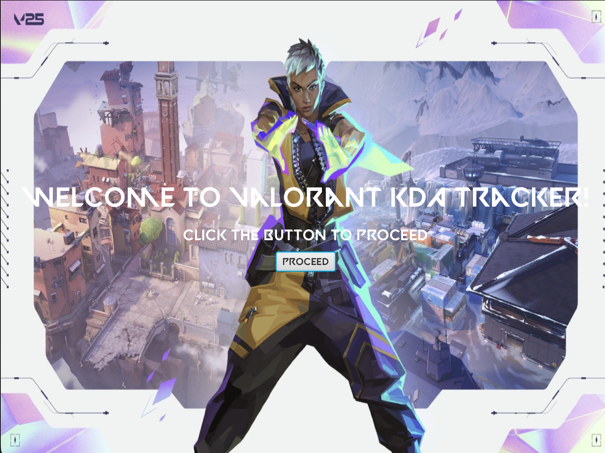
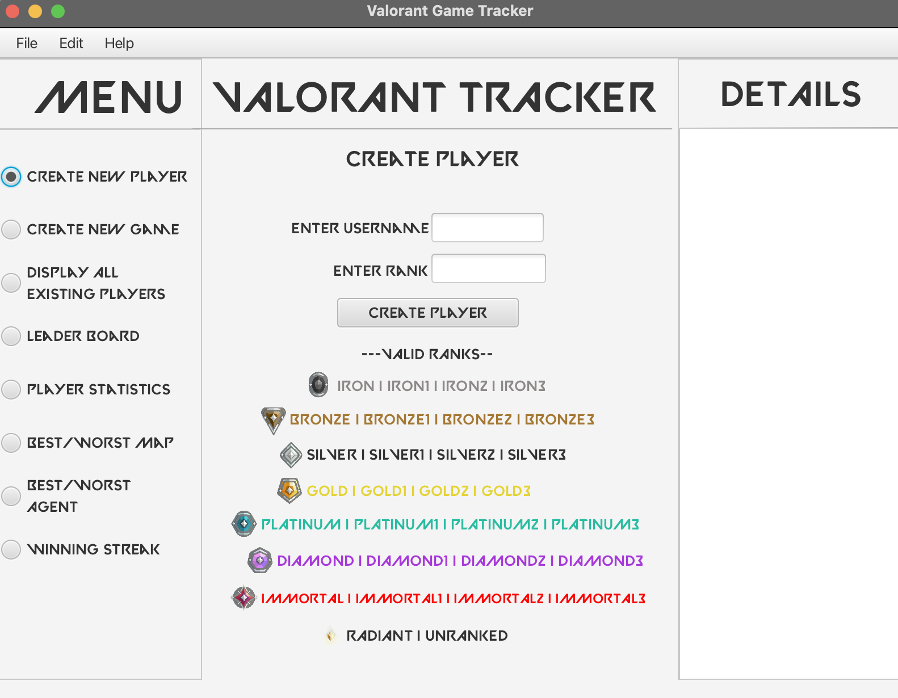

# Valorant Stat Tracker

## Author 
**Suyog Bhat**

Date: April 21st 2025

## Description
Java desktop application built with JavaFX and Maven that tracks and analyzes Valorant match statistics through a graphical user interface.

The Valorant Stat Tracker is a program that allows users to manage and view their in-game statistics about their Valorant matches. Users can:
- Create and manage player profiles with usernames and ranks.
- Record game details including map, agent, game mode, kills, deaths, assists, and game results (win/loss).
- View all created players and their recorded statistics.
- Load and save player and game details to/from a file.

The application is designed with an object-oriented structure using Java classes such as `Player`, `Game`, `Data`, and `LeaderboardEntry`, alongside enums like `Rank`, `Maps`, `Agents`, and `Gamemode`.

## Features
- **Custom Player Profiles:** Easily create and manage multiple Valorant player profiles.
- **Match Tracking:** Input and store detailed stats from each match.
- **Leaderboard:** Automatically generate a leaderboard based on KDA ratio.
- **Persistent Storage:** Load and save player/game data from CSV files.
- **JavaFX UI:** Simple, user-friendly graphical interface.
- **Custom Styling:** Uses Valorant-style fonts and custom CSS for visual design.

## How to Run From Source

1. Ensure you have Java installed on your machine.
2. Clone the repository or download the source code.
3. Open a terminal and navigate to the directory containing the source code.
4. Run the main application using:
   ```bash
    java --module-path /path/to/javafx/lib --add-modules javafx.controls,javafx.fxml -cp out ca.ucalgary.sbhat.projectvaloranttrackergui.HelloApplication "path/to/game/file/username_games.csv"
    ```
5. Follow the on-screen instructions to create players, record games, and view statistics.
6. To save or load player data, use the provided options in the menu.
7. To exit the application, select the exit option from the menu.

## How to Run the JAR File

1. Ensure that Java is installed on your machine.
2. Make sure JavaFX SDK is available and the path is known.
3. Open a terminal and navigate to the directory containing the .jar file.
4. Run the application using the following command:
   ```bash
   java --module-path "/path/to/javafx-sdk-23/lib" --add-modules javafx.controls,javafx.fxml -jar project-valorant-tracker-GUI.jar [username]_games.csv
   ```
5. Follow the on-screen instructions to create players, record games, and view statistics.
6. The application should launch with the JavaFX UI.

## Screenshots

### Startup Screen


### Main Program


## Technologies Used
- Java 23
- JavaFX
- Maven
- Object-Oriented Programming (OOP)
- Enum Classes
- CSV File I/O

## Notes
- Ensure that file paths use forward slashes (/) and are valid for your OS.
- The application uses a custom Valorant-style font; make sure the font file is included in the correct directory.
- If the application crashes or does not display correctly, double-check that JavaFX is correctly configured.
